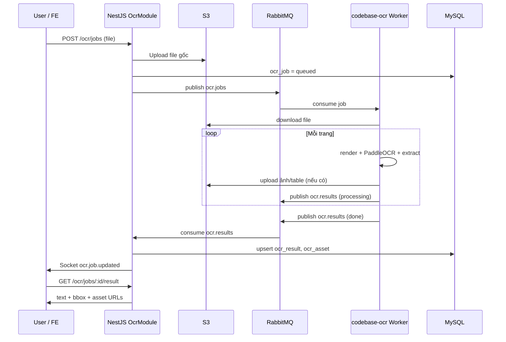

# Luồng dữ liệu — codebase-ocr

Tài liệu tổng quan luồng dữ liệu của worker PaddleOCR trong hệ sinh thái OCR bất đồng bộ.

> Liên quan: `codebase-admin/docs/OCR_BACKEND_PLAN.md`, contract message tại
> `codebase-admin/src/queues/ocr-queue.interface.ts` và `app/schemas.py`.

---

## Vai trò trong hệ thống

`codebase-ocr` là **worker Python chạy nền** — không expose HTTP API cho client. Worker chỉ:

1. **Consume** message từ RabbitMQ.
2. Tải file từ S3, xử lý OCR trong bộ nhớ / file tạm.
3. Upload asset (ảnh/table) lên S3.
4. **Publish** kết quả metadata qua RabbitMQ.

Toàn bộ hệ thống OCR:

```
Client (FE / App)
      │
      ▼ HTTP
NestJS OcrModule (codebase-admin)
      │ publish ocr.jobs / ocr.export
      ▼
RabbitMQ ◄──────────────────────────────┐
      │ consume                           │ publish ocr.results / ocr.export.results
      ▼                                   │
codebase-ocr Worker ──────────────────────┘
      │
      ▼
S3 (file gốc + ảnh/table/export)
```

Backend lưu trạng thái job và kết quả vào **MySQL**, đồng thời bắn **Socket.IO** (`ocr.job.updated`) cho client.

---

## Khởi động worker

Entry point: `app/worker.py` → class `Worker`.

| Bước | Mô tả |
|------|--------|
| 1 | Bật health server (`GET /health`, port `OCR_HEALTH_PORT`, mặc định 8080) |
| 2 | Warm-up `OcrEngine` (singleton PaddleOCR) — load model `vi`/`en` |
| 3 | Kết nối RabbitMQ, khai báo queue `durable=True` |
| 4 | `basic_qos(prefetch=OCR_PREFETCH)` — giới hạn số message xử lý đồng thời |
| 5 | Consume `ocr.jobs` + `ocr.export`; mất kết nối → reconnect sau 5s |

Queue sử dụng:

| Queue | Hướng | Mục đích |
|-------|-------|----------|
| `ocr.jobs` | Backend → Worker | Job OCR mới |
| `ocr.results` | Worker → Backend | Kết quả OCR (tiến độ + done/failed) |
| `ocr.export` | Backend → Worker | Job export searchable PDF |
| `ocr.export.results` | Worker → Backend | Kết quả export |
| `ocr.dlx` | Worker (debug) | Message lỗi / hỏng để debug |

---

## Luồng OCR chính (`ocr.jobs` → `ocr.results`)

### A. Backend gửi job

User upload qua `POST /ocr/jobs` (NestJS). Backend:

1. Upload file lên S3 (`MediaService`).
2. Tạo row `ocr_job` (`status = queued`).
3. Publish message vào `ocr.jobs`.

**Ví dụ message** (`OcrJobMessage`):

```json
{
  "jobId": 1,
  "fileUrl": "https://.../file.pdf",
  "fileKey": "ocr/abc.pdf",
  "lang": "vi",
  "pages": [1, 2],
  "mode": "layout",
  "extractImages": true
}
```

### B. Worker nhận message

`worker._on_message()`:

1. Parse JSON → `OcrJobMessage` (Pydantic, `app/schemas.py`).
2. Message hỏng → đẩy `ocr.dlx` + `ack` (tránh loop).
3. Gọi `JobProcessor.process(job, publish_callback)`.
4. Lỗi xử lý → retry tối đa `OCR_MAX_RETRIES` (mặc định 2); hết retry → publish `status: failed` + DLX + `ack`.

### C. Pipeline xử lý 1 job (`processor.py`)

```
ocr.jobs
   │
   ▼
S3Client.download(fileUrl, fileKey) → file tạm trên disk
   │
   ▼
DocumentRenderer (pdf_renderer.py)
   ├─ PDF  → PyMuPDF render từng trang @ OCR_RENDER_DPI
   └─ Ảnh  → đọc 1 trang (PIL)
   │
   ▼ (mỗi trang)
OcrEngine.ocr_page() → List[OcrLine] (text, confidence, bbox)
   │
   ▼ (nếu extractImages && OCR_EXTRACT_IMAGES)
ImageExtractor → images[] + tables[] → upload S3
   │
   ▼
Publish OcrResultMessage → ocr.results
```

### D. Xử lý từng trang

| Bước | Module | Input → Output |
|------|--------|----------------|
| Tải file | `s3_client.py` | `fileUrl` / `fileKey` → file tạm |
| Render | `pdf_renderer.py` | File → `RenderedPage` (numpy RGB, width, height, `fitz_page` nếu PDF) |
| OCR text | `ocr_engine.py` | Ảnh numpy → `OcrLine[]` |
| Tách ảnh | `image_extractor.py` | Trang render → `images[]`, `tables[]` (URL S3) |
| Publish | `worker.py` | `OcrResultMessage` → `ocr.results` |

**Tách ảnh** (khi bật):

1. **Embedded** (PDF digital): PyMuPDF `get_images()` — ảnh gốc chất lượng cao + bbox.
2. **Layout** (PP-Structure): phát hiện `figure` / `table` trên ảnh render (hữu ích cho scan).
3. **Dedup**: IoU bbox giữa embedded và layout (`OCR_DEDUP_IOU`, mặc định 0.6).
4. Bỏ asset quá nhỏ (`OCR_MIN_ASSET_AREA_RATIO`, mặc định 1% diện tích trang).

### E. Publish tiến độ (streaming)

Worker gửi nhiều message, không đợi xong hết:

```
status: "processing", processedPages: 0, totalPages: N     ← bắt đầu
status: "processing", pages: [...], processedPages: k      ← sau mỗi OCR_PROGRESS_EVERY trang
status: "done",       pages: [...], processedPages: N     ← hoàn tất
status: "failed",     error: "..."                         ← lỗi
```

Backend (`OcrService.handleResult`) upsert `ocr_result` + `ocr_asset` theo batch, emit Socket `ocr.job.updated`.

### F. Kết quả cuối (`ocr.results`)

```json
{
  "jobId": 1,
  "status": "done",
  "processedPages": 2,
  "totalPages": 2,
  "pages": [{
    "page": 1,
    "width": 1654,
    "height": 2339,
    "lines": [{ "text": "...", "confidence": 0.98, "bbox": [[x,y],...] }],
    "images": [{
      "type": "image|figure",
      "bbox": [[x,y],...],
      "imageUrl": "...",
      "imageKey": "...",
      "source": "embedded|layout"
    }],
    "tables": [{
      "type": "table",
      "bbox": [[x,y],...],
      "imageUrl": "...",
      "tableHtml": "<table>...",
      "source": "layout"
    }]
  }]
}
```

Field dùng **camelCase** (`jobId`, `processedPages`, …) để khớp TypeScript backend.

---

## Luồng export PDF tìm kiếm được (`ocr.export`)

Kích hoạt khi user gọi `POST /ocr/jobs/:id/export` với `format: pdf`.

```
Backend → ocr.export → worker._on_export_message → PdfExporter → S3 → ocr.export.results
```

1. Backend gửi file gốc + text/bbox đã OCR (không OCR lại).
2. Worker tải file, `PdfExporter.build()`:
   - Render lại từng trang thành ảnh.
   - Chèn lớp text ẩn (`render_mode=3`) đúng vị trí bbox → PDF searchable.
3. Upload PDF lên S3 (`OCR_S3_EXPORT_PREFIX`, mặc định `ocr/export/`).
4. Publish `OcrExportResultMessage` (`status: done`, `url`, `key`).

**Job export** (`OcrExportMessage`):

```json
{
  "jobId": 1,
  "format": "pdf",
  "fileUrl": "https://.../file.pdf",
  "fileKey": "ocr/abc.pdf",
  "lang": "vi",
  "pages": [{ "page": 1, "lines": [{ "text": "...", "bbox": [[x,y],...] }] }]
}
```

---

## Sequence diagram (end-to-end)



---

## Module và trách nhiệm

| File | Vai trò |
|------|---------|
| `app/worker.py` | Điều phối RMQ: nhận job, retry, DLX, publish kết quả |
| `app/processor.py` | Orchestrator 1 job: download → render → OCR → extract → publish |
| `app/schemas.py` | Contract JSON (Pydantic), khớp `ocr-queue.interface.ts` |
| `app/pdf_renderer.py` | PDF/ảnh → `numpy` RGB theo trang |
| `app/ocr_engine.py` | PaddleOCR (text) + PP-Structure (layout/table), singleton |
| `app/image_extractor.py` | Tách figure/table, upload S3, dedup IoU |
| `app/s3_client.py` | Download file gốc (HTTP ưu tiên, fallback boto3), upload asset |
| `app/pdf_export.py` | Dựng searchable PDF từ bbox đã có |
| `app/config.py` | Đọc env: RMQ, S3, DPI, retry, prefetch, … |
| `app/health.py` | HTTP `/health` cho Docker / k8s readiness |

---

## Xử lý lỗi và độ bền

| Cơ chế | Mô tả |
|--------|--------|
| Retry trong process | Job lỗi → thử lại `OCR_MAX_RETRIES` lần, back-off 2s, 4s, … |
| DLX (`ocr.dlx`) | Message lỗi/hỏng copy để debug, rồi `ack` tránh loop vô hạn |
| Persistent message | `delivery_mode=2` khi publish |
| Idempotent backend | Upsert theo `(jobId, pageNumber)` — worker gửi lại cùng trang an toàn |
| File tạm | Luôn xóa sau xử lý (`finally: os.remove`) |
| Reconnect RMQ | Mất kết nối → retry sau 5s, không crash process |
| Heartbeat | `OCR_RMQ_HEARTBEAT` (mặc định 600s) — OCR lâu không bị rớt kết nối |

---

## Lưu ý quan trọng

1. **Worker không ghi DB** — chỉ S3 + RabbitMQ; persistence ở NestJS.
2. **Bbox theo pixel ảnh render** (DPI mặc định 240), không phải điểm PDF gốc. FE overlay bbox lên preview cùng tỉ lệ/DPI.
3. **Hai luồng độc lập**: OCR (`ocr.jobs` / `ocr.results`) và Export (`ocr.export` / `ocr.export.results`).
4. **Scale horizontal**: nhiều container worker (`docker compose up --scale codebase-ocr=N`); RabbitMQ phân phối job theo prefetch.
5. **Ngôn ngữ OCR**: `vi`, `en`, `auto` (map sang `vi` trong engine); fallback `latin` nếu model không có.

---

## API backend liên quan (tham chiếu)

| Endpoint | Mô tả |
|----------|--------|
| `POST /ocr/jobs` | Upload file, tạo job, publish `ocr.jobs` |
| `GET /ocr/jobs/:id` | Trạng thái job |
| `GET /ocr/jobs/:id/result?page=` | Text + bbox theo trang |
| `GET /ocr/jobs/:id/assets?page=&type=` | Ảnh/figure/table đã tách |
| `POST /ocr/jobs/:id/export` | Export txt (sync) hoặc pdf (async qua `ocr.export`) |
| Socket `ocr.job.updated` | Realtime tiến độ |
